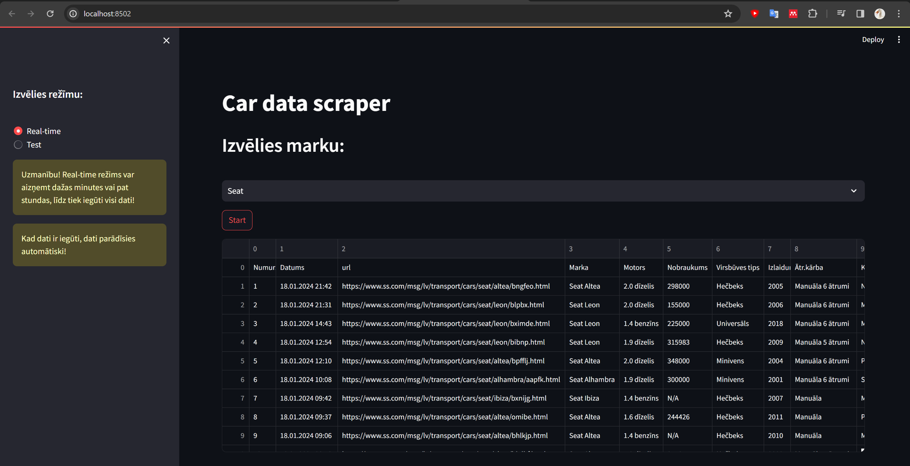

```
    Rīgas Tehniskā universitāte
    RDBI0 Informācijas tehnoloģija
    Marks Dvojeglazovs, 231RDB214
```

ss.lv/ss.com car characteristics scraper
=======================

Izmantošana
-----------------------
1. Lejupielādēt repozitoriju;
2. Atvērt komandrindu un pāriet uz repozitorija direktoriju;
3. Instalēt bibliotēkas, ja nepieciešams:
    * `pip install selenium`;
    * `pip install openpyxl`;
    * `pip install streamlit`;
    * `pip install pandas`;
4. Palaist `streamlit run ui.py` komandu konsolē.

Teorētiskā daļa
-----------------------
**Problēma**: ss.lv savā paplašīnātā meklēšanas funkcijā neļauj meklēt pēc auto komplektācijas. Tas ir svarīgi, lai atrastu sev piemērotāko auto.
Tāpēc ir nepieciešams izveidot programmu, kas spēj iegūt auto īpašības no ss.lv un saglabāt tos Excel failā, lai pēc tam varētu apskatīt tos tabulā.

Ši programma ļauj ar web interfeisu, izmantojot **streamlit**, iegūt auto īpašības no ss.lv, izmantojot **selenium** un saglabāt tos Excel failā, izmantojot **openpyxl**.
Ir realizēta iespēja izmantot datus realā laikā (real-time režims) vai iegūt datus no saglabātā Excel faila no direktorijas /test-wb/ (test režims).
*NB! Reāla laika ispildīšana var aizņemt daudz laika, jo ir jāiegūst dati no katras auto lapas, kas atrodas ss.lv. Piemēŗām, saņemt datus par Volkswagen man aizņem 2 stundas un 23 minutes. Tāpēc populāriem auto brendiem ir ieteicams izmantot test režīmu, lai iegūtu datus no iepriekš sagatavota Excel faila.*

Streamlit bibliotēka ļauj izveidot web interfeisu, izmantojot Python. Tas ļauj izveidot ļoti vienkāršu un intuitīvu interfeisu, kas ir viegli izmantot, bet neizmantojot HTML un JavaScript.
Selenium bibliotēka ļauj automatizēt darbības, kas tiek veiktas pārlūkprogrammā. Tā ļauj iegūt datus no ss.lv.
Openpyxl bibliotēka ļauj izveidot un rediģēt Excel failus. Tā ļauj saglabāt datus Excel failā.

Programmas interfeiss:

#### Izmantotās tehnoloģijas
* Python
  * Selenium
  * Openpyxl
  * Streamlit
* Excel
* Google Chrome
* Web Scraper - Google extension
#### Izmantotie resursi
* [Selenium dokumentācija](https://selenium-python.readthedocs.io/)
* [Openpyxl dokumentācija](https://openpyxl.readthedocs.io/en/stable/)
* [Streamlit dokumentācija](https://docs.streamlit.io/en/stable/)
* [Python dokumentācija](https://docs.python.org/3/)
* [Stackoverflow](https://stackoverflow.com/)
* GitHub repozitorijas
  * https://github.com/markpinecone/SS_LV_Scraper
  * https://github.com/danaki/ss-scraper
  * https://github.com/ajurenoks/dip225_1

#### Informācija
Ši programma nav asociēta ar ss.lv. Tā ir izveidota tikai mācību nolūkos.
To izmantošana var izraisīt bloķēšanu no ss.lv puses, jo ir izmantots web scraper ar tukstošiem pieprasījumu.